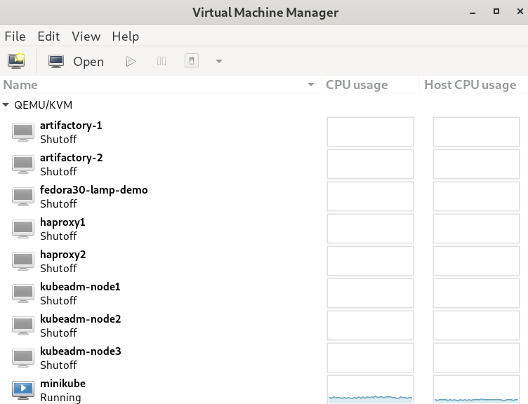
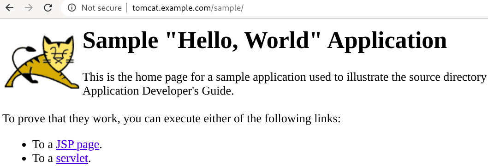
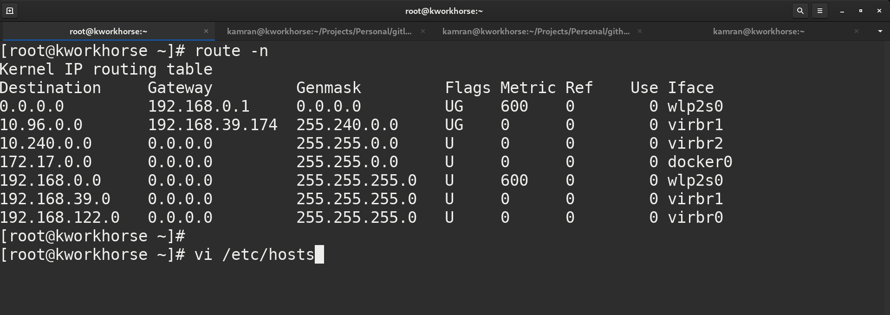
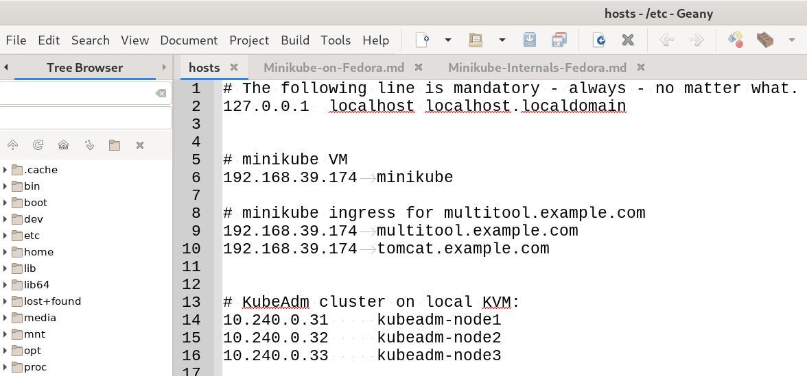
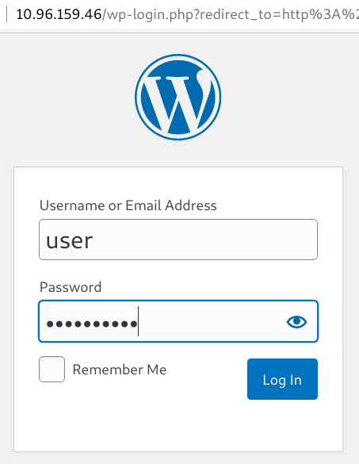
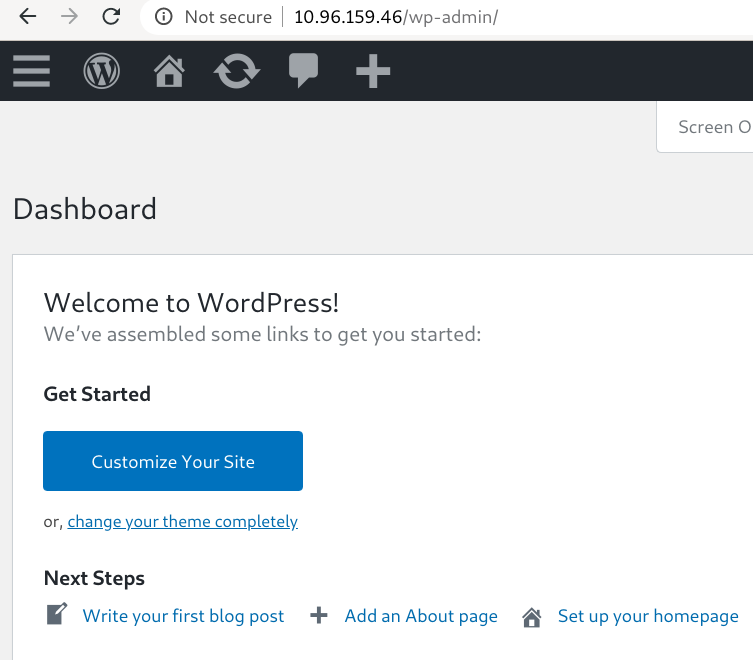

# Deploying applications locally on minikube:
If you are a developer (or even a system administrator), and you want to experiment with [Kubernetes](https://kubernetes.io), then [minikube](https://github.com/kubernetes/minikube) is something you should really look into. It is a simple single-node kubernetes cluster, which installs easy on your work computer - as a small virtual machine. It is open-source, and is free of cost. It is especially useful, when you want to learn / work with Kubernetes, but can't afford to run even a small Kubernetes cluster in a cloud environment, such as GCP, etc. 

The emphasis is on having minikube *running as a VM*, (not as a process on docker), because this takes away all the possible complexity away from your local computer. It (minikube VM) makes setting up and running the kubernetes cluster very easy. 

## What do you need to get it to work?
You need decently powered computer, with following specs:
* CPUs with hardware virtualization (Intel VT or AMD-V). Normally Intel's i3, i5, i7 (and now i9), and AMD's FX 63xx, 83xx, 9xxx, A10, A8, etc  are a good choices. 
* Minimum 4 GB RAM is good enough if you want to run Linux. Minikube takes 2 GB RAM from host computer, and assigns it to the minikube VM. If you are using Windows, then you need more, because windows is basically bloatware, and it just abuses RAM. 
* At least 20 GB free disk-space on your host OS, because minikube will create a 20 GB virtual disk. You can increase the size of the virtual disk at the time of minikube setup.
* A Hypervisor running on the computer, such as KVM. I don't recommend VirtualBox, or HyperV, or anything else. However, if you are on Windows or Mac, then you have no choice but to use one of these.
* Chromebooks will not work.

## Install and Setup Minikube on your local computer:
Lets install minikube on our system. The computer I am using is an Intel i7, 16 GB RAM, runs Fedora Linux 31, and runs KVM as Hypervisor. Just so you know, KVM is world's strongest, most efficient and most lightweight Hypervisor. It runs directly inside the Linux kernel - as a loadable kernel module. RedHat (world's largest open source company) uses KVM in the heart of it's **RedHat Enterprise Virtualization** product. AWS (the biggest cloud provider) is also moving it's infrastructure from XEN to KVM.

**Note:** This document was written for a computer, which has Fedora Linux as Host OS and KVM as Hypervisor. If you have a different OS or Hypervisor on your computer, then you need to consult a different guide for installing minikube on your computer.
 
### Prerequisites:
Besides OS and Hypervisor, you also need some additional software.

If you installed Google-Cloud-SDK on your computer, then you should know that it provides lots of packages, such as `kubectl`, *as well as* `minikube`! You can install these using gcloud commands:
```
gcloud components list

gcloud components install COMPONENT_ID
```

In case you installed google-cloud-sdk YUM repository, then installing these packages is as simple as `yum install <package-name>` 

```
[root@kworkhorse ~]# yum --disablerepo="*" --enablerepo="google-cloud-sdk" list available
Last metadata expiration check: 1:16:01 ago on Thu 16 Apr 2020 09:29:37 PM CEST.
Available Packages
google-cloud-sdk.noarch                                                        289.0.0-1            google-cloud-sdk
google-cloud-sdk-anthos-auth.x86_64                                            289.0.0-1            google-cloud-sdk
google-cloud-sdk-app-engine-go.x86_64                                          289.0.0-1            google-cloud-sdk
google-cloud-sdk-app-engine-grpc.x86_64                                        289.0.0-1            google-cloud-sdk
google-cloud-sdk-app-engine-java.noarch                                        289.0.0-1            google-cloud-sdk
google-cloud-sdk-app-engine-python.noarch                                      289.0.0-1            google-cloud-sdk
google-cloud-sdk-app-engine-python-extras.noarch                               289.0.0-1            google-cloud-sdk
google-cloud-sdk-bigtable-emulator.x86_64                                      289.0.0-1            google-cloud-sdk
google-cloud-sdk-cbt.x86_64                                                    289.0.0-1            google-cloud-sdk
google-cloud-sdk-cloud-build-local.x86_64                                      289.0.0-1            google-cloud-sdk
google-cloud-sdk-datalab.noarch                                                289.0.0-1            google-cloud-sdk
google-cloud-sdk-datastore-emulator.noarch                                     289.0.0-1            google-cloud-sdk
google-cloud-sdk-firestore-emulator.noarch                                     289.0.0-1            google-cloud-sdk
google-cloud-sdk-kind.x86_64                                                   289.0.0-1            google-cloud-sdk
google-cloud-sdk-kpt.x86_64                                                    289.0.0-1            google-cloud-sdk
google-cloud-sdk-minikube.x86_64                                               289.0.0-1            google-cloud-sdk                           
google-cloud-sdk-pubsub-emulator.noarch                                        289.0.0-1            google-cloud-sdk
google-cloud-sdk-skaffold.x86_64                                               289.0.0-1            google-cloud-sdk
google-cloud-sdk-spanner-emulator.x86_64                                       289.0.0-1            google-cloud-sdk
google-cloud-sdk-tests.noarch                                                  289.0.0-1            google-cloud-sdk
kubectl.x86_64                                                                 1.18.1-0             google-cloud-sdk
[root@kworkhorse ~]# 
```

```
[root@kworkhorse ~]# yum search minikube
Last metadata expiration check: 0:39:56 ago on Thu 16 Apr 2020 09:29:40 PM CEST.
===================== Name Matched: minikube ======================
google-cloud-sdk-minikube.x86_64 : Google Cloud SDK
[root@kworkhorse ~]# 
``` 

### Install the minikube package:
``` 
[root@kworkhorse ~]# yum -y install google-cloud-sdk-minikube.x86_64
Last metadata expiration check: 0:41:25 ago on Thu 16 Apr 2020 09:29:40 PM CEST.
Dependencies resolved.
===================================================================
 Package                   Arch   Version   Repository        Size
===================================================================
Installing:
 google-cloud-sdk-minikube x86_64 289.0.0-1 google-cloud-sdk  13 M

Transaction Summary
===================================================================
Install  1 Package

Total download size: 13 M
Installed size: 43 M
Downloading Packages:
02311b8ff662232b90e0df30503bba809f 3.2 MB/s |  13 MB     00:04    
-------------------------------------------------------------------
Total                              3.2 MB/s |  13 MB     00:04     
Running transaction check
Transaction check succeeded.
Running transaction test
Transaction test succeeded.
Running transaction
  Preparing        :                                           1/1 
  Installing       : google-cloud-sdk-minikube-289.0.0-1.x86   1/1 
  Running scriptlet: google-cloud-sdk-minikube-289.0.0-1.x86   1/1 
  Verifying        : google-cloud-sdk-minikube-289.0.0-1.x86   1/1 

Installed:
  google-cloud-sdk-minikube-289.0.0-1.x86_64                       

Complete!
[root@kworkhorse ~]#
``` 


### Setup minikube VM:
```
[kamran@kworkhorse ~]$ minikube start --driver=kvm2
😄  minikube v1.9.2 on Fedora 31
    ▪ KUBECONFIG=/home/kamran/.kube/config:/home/kamran/.kube/kubeadm-cluster.conf
✨  Using the kvm2 driver based on user configuration
💾  Downloading driver docker-machine-driver-kvm2:
    > docker-machine-driver-kvm2.sha256: 65 B / 65 B [-------] 100.00% ? p/s 0s
    > docker-machine-driver-kvm2: 13.88 MiB / 13.88 MiB  100.00% 2.46 MiB p/s 5
💿  Downloading VM boot image ...
    > minikube-v1.9.0.iso.sha256: 65 B / 65 B [--------------] 100.00% ? p/s 0s
    > minikube-v1.9.0.iso: 174.93 MiB / 174.93 MiB [-] 100.00% 6.20 MiB p/s 29s
👍  Starting control plane node m01 in cluster minikube
💾  Downloading Kubernetes v1.18.0 preload ...
    > preloaded-images-k8s-v2-v1.18.0-docker-overlay2-amd64.tar.lz4: 542.91 MiB
🔥  Creating kvm2 VM (CPUs=2, Memory=3900MB, Disk=20000MB) ...
🐳  Preparing Kubernetes v1.18.0 on Docker 19.03.8 ...
🌟  Enabling addons: default-storageclass, storage-provisioner
🏄  Done! kubectl is now configured to use "minikube"

❗  /usr/local/bin/kubectl is v1.13.4, which may be incompatible with Kubernetes v1.18.0.
💡  You can also use 'minikube kubectl -- get pods' to invoke a matching version
[kamran@kworkhorse ~]$ 
```

At this point, you should see minikube VM running in KVM:
|   |
| --------------------------------------------------------------- |


```
[kamran@kworkhorse ~]$ kubectl get nodes
NAME       STATUS   ROLES    AGE   VERSION
minikube   Ready    master   2m    v1.18.0
[kamran@kworkhorse ~]$ 
```

### Minikube Addons:
By deafult, Minikube brings several addons with it in the deafult installation, but only few are enabled. Depending on your needs you can enable different addons.

```
[kamran@kworkhorse ~]$ minikube addons list
|-----------------------------|----------|--------------|
|         ADDON NAME          | PROFILE  |    STATUS    |
|-----------------------------|----------|--------------|
| dashboard                   | minikube | disabled     |
| default-storageclass        | minikube | enabled ✅   |
| efk                         | minikube | disabled     |
| freshpod                    | minikube | disabled     |
| gvisor                      | minikube | disabled     |
| helm-tiller                 | minikube | disabled     |
| ingress                     | minikube | disabled     |
| ingress-dns                 | minikube | disabled     |
| istio                       | minikube | disabled     |
| istio-provisioner           | minikube | disabled     |
| logviewer                   | minikube | disabled     |
| metrics-server              | minikube | disabled     |
| nvidia-driver-installer     | minikube | disabled     |
| nvidia-gpu-device-plugin    | minikube | disabled     |
| registry                    | minikube | disabled     |
| registry-aliases            | minikube | disabled     |
| registry-creds              | minikube | disabled     |
| storage-provisioner         | minikube | enabled ✅   |
| storage-provisioner-gluster | minikube | disabled     |
|-----------------------------|----------|--------------|
[kamran@kworkhorse ~]$ 
```

```
[kamran@kworkhorse ~]$ minikube addons enable dashboard
🌟  The 'dashboard' addon is enabled
[kamran@kworkhorse ~]$ 
```

To use the dashboard addon, run the `minikube dashboard` command:

```
[kamran@kworkhorse ~]$ minikube dashboard
🤔  Verifying dashboard health ...
🚀  Launching proxy ...
🤔  Verifying proxy health ...
🎉  Opening http://127.0.0.1:37419/api/v1/namespaces/kubernetes-dashboard/services/http:kubernetes-dashboard:/proxy/ in your default browser...
Opening in existing browser session.
```

(At this point a browser window will open in your computer and Kubernetes dashboard will be running visible inside it.)

|   |
| --------------------------------------------------------------- |


One more addon that will surely prove useful is the `metrics-server`. It will help you figure out how much CPU and RAM your pods (and node) are consuming.

``` 
[kamran@kworkhorse ~]$ minikube addons enable metrics-server
🌟  The 'metrics-server' addon is enabled
[kamran@kworkhorse ~]$ 
``` 

Nodes - CPU and RAM usage:
```
[kamran@kworkhorse ~]$ kubectl top nodes
NAME       CPU(cores)   CPU%   MEMORY(bytes)   MEMORY%   
minikube   153m         7%     1193Mi          33%       
[kamran@kworkhorse ~]$ 
```

Pods - CPU and RAM usage:
```
[kamran@kworkhorse ~]$ kubectl top pods --all-namespaces
NAMESPACE              NAME                                         CPU(cores)   MEMORY(bytes)   
kube-system            coredns-66bff467f8-dww5p                     2m           6Mi             
kube-system            coredns-66bff467f8-hnbxp                     2m           6Mi             
kube-system            etcd-minikube                                24m          47Mi            
kube-system            kube-apiserver-minikube                      48m          281Mi           
kube-system            kube-controller-manager-minikube             20m          34Mi            
kube-system            kube-proxy-hdc9r                             0m           13Mi            
kube-system            kube-scheduler-minikube                      4m           10Mi            
kube-system            metrics-server-7bc6d75975-kp4kp              0m           10Mi            
kube-system            storage-provisioner                          0m           17Mi            
kube-system            tiller-deploy-58bf6f4995-nvwc6               0m           6Mi             
kubernetes-dashboard   dashboard-metrics-scraper-84bfdf55ff-jtp2z   0m           4Mi             
kubernetes-dashboard   kubernetes-dashboard-bc446cc64-wccx9         0m           7Mi             
[kamran@kworkhorse ~]$ 
```


Install Helm-Tiller addon, which is good to install helm charts on your minikube cluster:
```
[kamran@kworkhorse ~]$ minikube addons enable helm-tiller
🌟  The 'helm-tiller' addon is enabled
[kamran@kworkhorse ~]$ 
```


The plugins you enable will show up as pods in the `kube-system` name-space.

```
[kamran@kworkhorse ~]$ kubectl --namespace=kube-system get pods
NAME                               READY   STATUS    RESTARTS   AGE
coredns-66bff467f8-dww5p           1/1     Running   0          47m
coredns-66bff467f8-hnbxp           1/1     Running   0          47m
etcd-minikube                      1/1     Running   0          47m
kube-apiserver-minikube            1/1     Running   0          47m
kube-controller-manager-minikube   1/1     Running   0          47m
kube-proxy-hdc9r                   1/1     Running   0          47m
kube-scheduler-minikube            1/1     Running   0          47m
metrics-server-7bc6d75975-kp4kp    1/1     Running   0          11m     <--- Addon added later
storage-provisioner                1/1     Running   1          47m
tiller-deploy-58bf6f4995-nvwc6     1/1     Running   0          89s     <--- Addon added later
[kamran@kworkhorse ~]$ 
```

## Stopping and starting minikube:

You can stop the VM using:
```
[kamran@kworkhorse ~]$ minikube stop
✋  Stopping "minikube" in kvm2 ...
🛑  Node "m01" stopped.
[kamran@kworkhorse ~]$ 
```

You can start an existing minikube VM by simply running the `minikube start` command. It will pick up all the configuration from files inside `~/.minikube/*` , and bring up the minikube VM in the same state as it was before (including addons). i.e. In such case, it will not create a new minikube VM.

```
[kamran@kworkhorse ~]$ minikube start
😄  minikube v1.9.2 on Fedora 31
    ▪ KUBECONFIG=/home/kamran/.kube/config:/home/kamran/.kube/kubeadm-cluster.conf
✨  Using the kvm2 driver based on existing profile
👍  Starting control plane node m01 in cluster minikube
🔄  Restarting existing kvm2 VM for "minikube" ...
🐳  Preparing Kubernetes v1.18.0 on Docker 19.03.8 ...
🌟  Enabling addons: dashboard, default-storageclass, helm-tiller, metrics-server, storage-provisioner
🏄  Done! kubectl is now configured to use "minikube"

❗  /usr/local/bin/kubectl is v1.13.4, which may be incompatible with Kubernetes v1.18.0.
💡  You can also use 'minikube kubectl -- get pods' to invoke a matching version
[kamran@kworkhorse ~]$ 
```

```
[kamran@kworkhorse ~]$ minikube status
m01
host: Running
kubelet: Running
apiserver: Running
kubeconfig: Configured

[kamran@kworkhorse ~]$ 
```

## Verify host-to-minikube connectivity:

Find the IP of your minikube machine. This is important for understanding, but we will talk about this in a moment.
```
[kamran@kworkhorse ~]$ minikube ip
192.168.39.174
```

```
[kamran@kworkhorse ~]$ ping 192.168.39.174
PING 192.168.39.174 (192.168.39.174) 56(84) bytes of data.
64 bytes from 192.168.39.174: icmp_seq=1 ttl=64 time=0.195 ms
64 bytes from 192.168.39.174: icmp_seq=2 ttl=64 time=0.272 ms
^C
--- 192.168.39.174 ping statistics ---
2 packets transmitted, 2 received, 0% packet loss, time 1009ms
rtt min/avg/max/mdev = 0.195/0.233/0.272/0.038 ms
[kamran@kworkhorse ~]$ 
```


For any OS related maintenance (or exploration), log onto the minikube vm directly, using `minikube ssh` command:
```
[kamran@kworkhorse ~]$ minikube ssh
                         _             _            
            _         _ ( )           ( )           
  ___ ___  (_)  ___  (_)| |/')  _   _ | |_      __  
/' _ ` _ `\| |/' _ `\| || , <  ( ) ( )| '_`\  /'__`\
| ( ) ( ) || || ( ) || || |\`\ | (_) || |_) )(  ___/
(_) (_) (_)(_)(_) (_)(_)(_) (_)`\___/'(_,__/'`\____)

$ 

$ sudo -i
sudo: /etc/environment: No such file or directory
# 
```
(Ignore the error message about `/etc/environment`) 


## About setting up `/etc/hosts` with minikube's IP on host computer:
Some people might be tempted to update minikube's IP address in /etc/hosts file, which is actually useless exercise. The reason is that IP address of the minikube VM will keep changing, and you will keep updating the `/etc/hosts` file. Essentially, you really not gain any advantage of putting this IP in `/etc/hosts`. 

In short, don't bother.

## Use kubectl to interact with kuberntes cluster running in minikube:
Now we have minikube installed. It is time to start using it. We already have kubectl installed on the host computer, and minikube has already created a `kube/config` for us. Minikube also sets the context for kubectl to use minikube cluster. So if we run `kubectl` commands against this cluster, the commands will work. 

```
[kamran@kworkhorse ~]$ kubectl config get-contexts
CURRENT   NAME                                                    CLUSTER                                                 AUTHINFO                                                NAMESPACE
          gke_trainingvideos_europe-north1-a_docker-to-k8s-demo   gke_trainingvideos_europe-north1-a_docker-to-k8s-demo   gke_trainingvideos_europe-north1-a_docker-to-k8s-demo   
          kubernetes-admin@kubernetes                             kubernetes                                              kubernetes-admin                                        
*         minikube                                                minikube                                                minikube                                                
[kamran@kworkhorse ~]$ 
```

```
[kamran@kworkhorse ~]$ kubectl get nodes -o wide
NAME       STATUS   ROLES    AGE     VERSION   INTERNAL-IP      EXTERNAL-IP   OS-IMAGE               KERNEL-VERSION   CONTAINER-RUNTIME
minikube   Ready    master   3d22h   v1.18.0   192.168.39.174   <none>        Buildroot 2019.02.10   4.19.107         docker://19.3.8
[kamran@kworkhorse ~]$ 
```

## Create our first deployment on this cluster:
Lets create our first deployment on this cluster, and then access it from our host computer.

```
[kamran@kworkhorse ~]$ kubectl create deployment nginx --image=nginx:alpine
deployment.apps/nginx created

[kamran@kworkhorse ~]$ kubectl get pods
NAME                     READY   STATUS    RESTARTS   AGE
nginx-745b4df97d-wjrtr   1/1     Running   0          14s
[kamran@kworkhorse ~]$ 
```

## Access your application through NodePort:
Lets expose this `deployment` as a service of `type: NodePort`, so we can access it from our host computer. 

```
[kamran@kworkhorse ~]$ kubectl expose deployment nginx --type=NodePort --port 80
service/nginx exposed


[kamran@kworkhorse ~]$ kubectl get svc
NAME         TYPE        CLUSTER-IP      EXTERNAL-IP   PORT(S)        AGE
kubernetes   ClusterIP   10.96.0.1       <none>        443/TCP        4d1h
nginx        NodePort    10.98.136.156   <none>        80:31255/TCP   6s
[kamran@kworkhorse ~]$ 

```

Now, we can access this service using our minikube VM's IP address and the NodePort assigned to the service.

```
[kamran@kworkhorse ~]$ curl 192.168.39.174:31255
<!DOCTYPE html>
<html>
<head>
<title>Welcome to nginx!</title>
. . . 
</head>
<h1>Welcome to nginx!</h1>
</html>
[kamran@kworkhorse ~]$ 
```

Great! So we can access the service using VM's IP and the NodePort of the service.

## Using MiniKube's built in LoadBalancer:
First, lets delete the existing nginx service , and create a new one as `type:LoadBalancer`.

```
[kamran@kworkhorse ~]$ kubectl delete service nginx
service/nginx deleted
```

```
[kamran@kworkhorse ~]$ kubectl expose deployment nginx --type=LoadBalancer --port 80
service/nginx exposed


[kamran@kworkhorse ~]$ kubectl get svc
NAME         TYPE           CLUSTER-IP      EXTERNAL-IP   PORT(S)        AGE
kubernetes   ClusterIP      10.96.0.1       <none>        443/TCP        4d21h
nginx        LoadBalancer   10.106.130.70   <pending>     80:32185/TCP   4s
[kamran@kworkhorse ~]$ 
```

Notice that the `EXTERNAL-IP` is in `<pending>` state. 

MiniKube's LoadBalancer is activated when we run `minikube tunnel` command. As soon as the internal loadbalancer comes up, the service gets an EXTERNAL-IP address.

Remember that `minikube tunnel` command needs to run in a separate terminal, and it will ask you `sudo` password. This is because `minikube tunnel` runs as a process, and creates an additional network route on your work computer, so that all traffic destined to `10.96.0.0/12` network is sent to `192.168.39.174` - which is the IP address of the minikube VM.

Here is the output of the `minikube tunnel` command:
```
[kamran@kworkhorse ~]$ minikube tunnel
[sudo] password for kamran: 
Status:	
	machine: minikube
	pid: 75840
	route: 10.96.0.0/12 -> 192.168.39.174
	minikube: Running
	services: [nginx]
    errors: 
		minikube: no errors
		router: no errors
		loadbalancer emulator: no errors
. . . 
```
(above goes on forever)


Here is the routing table from my work-computer (the physical/KVM host) - *after* the `minikube tunnel` command is executed:

```
[root@kworkhorse ~]# route -n
Kernel IP routing table
Destination     Gateway         Genmask         Flags Metric Ref    Use Iface
0.0.0.0         192.168.0.1     0.0.0.0         UG    600    0        0 wlp2s0
10.96.0.0       192.168.39.174  255.240.0.0     UG    0      0        0 virbr1   <------- This one!
10.240.0.0      0.0.0.0         255.255.0.0     U     0      0        0 virbr2
172.17.0.0      0.0.0.0         255.255.0.0     U     0      0        0 docker0
172.18.0.0      0.0.0.0         255.255.0.0     U     0      0        0 br-cc4817088a63
192.168.0.0     0.0.0.0         255.255.255.0   U     600    0        0 wlp2s0
192.168.39.0    0.0.0.0         255.255.255.0   U     0      0        0 virbr1
192.168.122.0   0.0.0.0         255.255.255.0   U     0      0        0 virbr0
[root@kworkhorse ~]# 
```

Back on the first terminal, if you check the list of services, you will see that your service has an EXTERNAL-IP address - `10.106.130.170`. 


```
[kamran@kworkhorse ~]$ kubectl  get svc
NAME         TYPE           CLUSTER-IP      EXTERNAL-IP     PORT(S)        AGE
kubernetes   ClusterIP      10.96.0.1       <none>          443/TCP        5d
nginx        LoadBalancer   10.106.130.70   10.106.130.70   80:32185/TCP   171m
[kamran@kworkhorse ~]$ 
```

You can now access your service as you would normally do through a LoadBalancer IP, without using any fancy ports.

```
[kamran@kworkhorse ~]$ curl 10.106.130.70
<!DOCTYPE html>
<html>
<head>
<title>Welcome to nginx!</title>

</head>
<body>
<h1>Welcome to nginx!</h1>
. . . 
<p><em>Thank you for using nginx.</em></p>
</body>
</html>
[kamran@kworkhorse ~]$
```

Hurray! It works!


**Note:**
When you stop the `minikube tunnel` command, (after you have let it run for a while), it will ask you `sudo` password again. This is ok. The reason is that when it stops, it wants to remove the routing entry from the host computer, which it made at the start time of the tunnel. So, when you stop it properly by providing your password for `sudo` use, it removes the routing entry from the routing table from the host computer.

```
. . . 
. . . 

Status:	
	machine: minikube
	pid: 349178
	route: 10.96.0.0/12 -> 192.168.39.174
	minikube: Running
	services: [myblog-wordpress, nginx]
    errors: 
		minikube: no errors
		router: no errors
		loadbalancer emulator: no errors

^C[sudo] password for kamran: 
[kamran@kworkhorse ~]$ 
```

If you check the routing table on the host, you won't find the entry for `10.96.0.0/12` anymore:
```
[root@kworkhorse ~]# route -n
Kernel IP routing table
Destination     Gateway         Genmask         Flags Metric Ref    Use Iface
0.0.0.0         192.168.0.1     0.0.0.0         UG    600    0        0 wlp2s0
10.240.0.0      0.0.0.0         255.255.0.0     U     0      0        0 virbr2
172.17.0.0      0.0.0.0         255.255.0.0     U     0      0        0 docker0
192.168.0.0     0.0.0.0         255.255.255.0   U     600    0        0 wlp2s0
192.168.39.0    0.0.0.0         255.255.255.0   U     0      0        0 virbr1
192.168.122.0   0.0.0.0         255.255.255.0   U     0      0        0 virbr0
[root@kworkhorse ~]# 
```


# Use minikube's built-in ingress controller:

You can use minikube's built-in ingress controller, which is based on nginx. It is a minikube add-on, so first, you will need to enable it.

```
[kamran@kworkhorse ~]$ minikube addons enable ingress
🌟  The 'ingress' addon is enabled
[kamran@kworkhorse ~]$ 
```


Verify that the NGINX Ingress controller is running in the `kube-system` namespace:

```
[kamran@kworkhorse ~]$ kubectl get pods -n kube-system
NAME                                        READY   STATUS    RESTARTS   AGE
coredns-66bff467f8-dww5p                    1/1     Running   3          5d13h
coredns-66bff467f8-hnbxp                    1/1     Running   3          5d13h
etcd-minikube                               1/1     Running   2          5d13h
kube-apiserver-minikube                     1/1     Running   2          5d13h
kube-controller-manager-minikube            1/1     Running   2          5d13h
kube-proxy-hdc9r                            1/1     Running   2          5d13h
kube-scheduler-minikube                     1/1     Running   2          5d13h
metrics-server-7bc6d75975-kp4kp             1/1     Running   3          5d12h
nginx-ingress-controller-6d57c87cb9-tbnqt   0/1     Running   0          58s      <----- This one!
storage-provisioner                         1/1     Running   4          5d13h
tiller-deploy-58bf6f4995-nvwc6              1/1     Running   2          5d12h
[kamran@kworkhorse ~]$ 
```


Create a deployment. Lets use `praqma/network-multitool` to run a new deployment.

```
[kamran@kworkhorse minikube]$ cat 01-multitool-deployment.yaml 
apiVersion: apps/v1
kind: Deployment
metadata:
  name: multitool
  labels:
    app: multitool
spec:
  selector:
    matchLabels:
      app: multitool
  template:
    metadata:
      labels:
        app: multitool
    spec:
      containers:
      - image: praqma/network-multitool
        name: multitool
        ports:
        - containerPort: 80
          name: http
        resources:
          limits:
            cpu: 10m
            memory: 50Mi
          requests:
            cpu: 5m
            memory: 10Mi
[kamran@kworkhorse minikube]$ 
```

```
[kamran@kworkhorse minikube]$ kubectl apply -f 01-multitool-deployment.yaml 
deployment.apps/multitool created
[kamran@kworkhorse minikube]$ 
```

```
[kamran@kworkhorse minikube]$ kubectl get pods
NAME                         READY   STATUS    RESTARTS   AGE
multitool-5dd8699c59-z5kdn   1/1     Running   0          110s
nginx-745b4df97d-wjrtr       1/1     Running   0          38h
[kamran@kworkhorse minikube]$
```

Expose this deployment as a service:

```
[kamran@kworkhorse minikube]$ kubectl expose deployment multitool --type ClusterIP --port 80
service/multitool exposed
[kamran@kworkhorse minikube]$ kubectl get svc 
NAME         TYPE           CLUSTER-IP       EXTERNAL-IP     PORT(S)        AGE
kubernetes   ClusterIP      10.96.0.1        <none>          443/TCP        5d13h
multitool    ClusterIP      10.102.171.156   <none>          80/TCP         20s
nginx        LoadBalancer   10.106.130.70    10.106.130.70   80:32185/TCP   15h
[kamran@kworkhorse minikube]$ 
```

Or, you can use the following file to create the same service (for multitool):

```
[kamran@kworkhorse minikube]$ cat 02-multitool-service.yaml 
apiVersion: v1
kind: Service
metadata:
  labels:
    app: multitool
  name: multitool
spec:
  ports:
  - port: 80
    protocol: TCP
    targetPort: 80
  selector:
    app: multitool
  type: ClusterIP
[kamran@kworkhorse minikube]$ 
```


Create an ingress for this service:

```
[kamran@kworkhorse minikube]$ cat 03-multitool-ingress.yaml 
apiVersion: networking.k8s.io/v1beta1 # for versions before 1.14 use extensions/v1beta1
kind: Ingress
metadata:
  name: multitool-ingress
spec:
  rules:
  - host: multitool.example.com
    http:
      paths:
      - path: /
        backend:
          serviceName: multitool
          servicePort: 80
[kamran@kworkhorse minikube]$ 
```

```
[kamran@kworkhorse minikube]$ kubectl apply -f  03-multitool-ingress.yaml 
ingress.networking.k8s.io/multitool-ingress created
[kamran@kworkhorse minikube]$ 
```

Verify that it is created:
```
[kamran@kworkhorse minikube]$ kubectl get ingress
NAME                CLASS    HOSTS                   ADDRESS          PORTS   AGE
multitool-ingress   <none>   multitool.example.com   192.168.39.174   80      17s
[kamran@kworkhorse minikube]$ 
```

Now, update your `/etc/hosts` and point `multitool.example.com` to the ip address being shown under the ADDRESS column. This address is actually the IP address of your minikube VM.

```
[root@kworkhorse ~]# cat /etc/hosts 
127.0.0.1  localhost localhost.localdomain

# minikube ingress for multitool.example.com
192.168.39.174	multitool.example.com
[root@kworkhorse ~]# 
```

The moment of truth. Access your multitool service from the host / your work computer:
```
[kamran@kworkhorse ~]$ curl multitool.example.com
Praqma Network MultiTool (with NGINX) - multitool-5dd8699c59-z5kdn - 172.17.0.10/16
[kamran@kworkhorse ~]$ 
```

It works!


## Run a `tomcat` container:
Tomcat runs on port 8080, so it will be a good example to see how a service running on a different port can be accessed through the ingress `tomcat.example.com` , using minikube's built-in ingress controller. 

For this example, I have created just one file, which contains all the three objects. i.e. `deployment`, `service`, `ingress`. Also, I am pulling a sample `.war` file into the tomcat container, so I have something to show.

Here is the file:

```
[kamran@kworkhorse minikube]$ cat tomcat-deploymet-service-ingress.yaml 
apiVersion: apps/v1
kind: Deployment
metadata:
  name: tomcat
  labels:
    app: tomcat
spec:
  selector:
    matchLabels:
      app: tomcat
  template:
    metadata:
      labels:
        app: tomcat
    spec:
      containers:
      - name: tomcat
        image: tomcat:9
        ports:
        - containerPort: 8080
        resources:
          limits:
            cpu: "50m"
          requests:
            cpu: 50m
        volumeMounts:
        - name: web-content-dir
          mountPath: /usr/local/tomcat/webapps/
      initContainers:
      - name: multitool
        image: praqma/network-multitool
        workingDir: /web-content
        command:
        - wget
        - "-O"
        - "/web-content/sample.war"
        - https://tomcat.apache.org/tomcat-9.0-doc/appdev/sample/sample.war
        resources:
          limits:
            cpu: "20m"
          requests:
            cpu: 20m
        volumeMounts:
        - name: web-content-dir
          mountPath: /web-content
      volumes:
      - name: web-content-dir
        emptyDir: {}
    
---

apiVersion: v1
kind: Service
metadata:
  namespace: default
  name: tomcat
  labels:
    app: tomcat
spec:
  ports:
    - port: 8080
  selector:
    app: tomcat
  type: ClusterIP

---
apiVersion: networking.k8s.io/v1beta1 # for versions before 1.14 use extensions/v1beta1
kind: Ingress
metadata:
  name: tomcat-ingress
  labels:
    app: tomcat
spec:
  rules:
  - host: tomcat.example.com
    http:
      paths:
      - path: /
        backend:
          serviceName: tomcat
          servicePort: 8080

[kamran@kworkhorse minikube]$ 
```

Lets create the deployment, service and ingress for tomcat:

```
[kamran@kworkhorse minikube]$ kubectl apply -f tomcat-deploymet-service-ingress.yaml 
deployment.apps/tomcat created
service/tomcat created
ingress.networking.k8s.io/tomcat-ingress created
[kamran@kworkhorse minikube]$ 
```

Verify that the objects are created:

```
[kamran@kworkhorse minikube]$ kubectl get deployments,services,ingress
NAME                        READY   UP-TO-DATE   AVAILABLE   AGE
deployment.apps/multitool   1/1     1            1           43m
deployment.apps/nginx       1/1     1            1           39h
deployment.apps/tomcat      1/1     1            1           94s

NAME                 TYPE           CLUSTER-IP       EXTERNAL-IP     PORT(S)        AGE
service/kubernetes   ClusterIP      10.96.0.1        <none>          443/TCP        5d14h
service/multitool    ClusterIP      10.102.171.156   <none>          80/TCP         38m
service/nginx        LoadBalancer   10.106.130.70    10.106.130.70   80:32185/TCP   16h
service/tomcat       ClusterIP      10.101.172.146   <none>          8080/TCP       94s

NAME                                   CLASS    HOSTS                   ADDRESS          PORTS   AGE
ingress.extensions/multitool-ingress   <none>   multitool.example.com   192.168.39.174   80      33m
ingress.extensions/tomcat-ingress      <none>   tomcat.example.com      192.168.39.174   80      94s
[kamran@kworkhorse minikube]$ 
```
**Note:** The `nginx` service of `type:LoadBalancer` showing up in the output above, has nothing to do with minikube's built-in ingress controller (which is also nginx based). The above nginx deployment and service is something we created earlier in this document.

Alright, so we have the three objects related to tomcat. Notice that the ingress `tomcat.example.com` is also using the same IP address as the ingress for multitool, and that IP address is the IP address of the minikube VM. This is OK. That is exactly how it is supposed to look like.

Lets see if we can access it from our host computer or not. To be able to do that, first we have to update `/etc/hosts` file and setup a host entry - as root (or sudo).

```
[root@kworkhorse ~]# cat /etc/hosts 
127.0.0.1  localhost localhost.localdomain

# minikube ingresses:
192.168.39.174	multitool.example.com
192.168.39.174	tomcat.example.com
[root@kworkhorse ~]# 
```
**Note:** If the IP address is same for two hosts/URLs, you can use write them together in a single line.

Lets access tomcat from the host:

```
[kamran@kworkhorse minikube]$ curl tomcat.example.com
<!doctype html><html lang="en"><head><title>HTTP Status 404 – Not Found</title><style type="text/css">body {font-family:Tahoma,Arial,sans-serif;} h1, h2, h3, b {color:white;background-color:#525D76;} h1 {font-size:22px;} h2 {font-size:16px;} h3 {font-size:14px;} p {font-size:12px;} a {color:black;} .line {height:1px;background-color:#525D76;border:none;}</style></head><body><h1>HTTP Status 404 – Not Found</h1><hr class="line" /><p><b>Type</b> Status Report</p><p><b>Message</b> Not found</p><p><b>Description</b> The origin server did not find a current representation for the target resource or is not willing to disclose that one exists.</p><hr class="line" /><h3>Apache Tomcat/9.0.34</h3></body></html>[kamran@kworkhorse minikube]$
```

Hurray! We can reach `tomcat.example.com` ! 

If you are wondering, why are we celebrating by seeing a `404`, and some garbage output displayed on the screen? Well, the output is actually *coming from Tomcat*, which simply states that it could not find any applications configured in it, or it will not reveal that any application exists. It expects you to write an index file, which users can use to reach respective applications, or simply use the application's URL directly. So if we see the output above, it means our ingress for `tomcat.example.com` is working and we *are* reaching the backend tomcat service. 

Remember, I copied a `sample.war` file in tomcat. That was to test tomcat using `http://tomcat.example.com/sample` . So lets do that.

```
[kamran@kworkhorse minikube]$ curl tomcat.example.com/sample
```

```
[kamran@kworkhorse minikube]$ curl -L tomcat.example.com/sample
<html>
<head>
<title>Sample "Hello, World" Application</title>
</head>
<body bgcolor=white>

<table border="0">
<tr>
<td>

</td>
<td>
<h1>Sample "Hello, World" Application</h1>
<p>This is the home page for a sample application used to illustrate the
source directory organization of a web application utilizing the principles
outlined in the Application Developer's Guide.
</td>
</tr>
</table>

<p>To prove that they work, you can execute either of the following links:
<ul>
<li>To a <a href="hello.jsp">JSP page</a>.
<li>To a <a href="hello">servlet</a>.
</ul>

</body>
</html>
[kamran@kworkhorse minikube]$ 
```

Here is a screenshot of the same from a browser:

|  |
| ----------------------------------------------------- |


## Warning about an annotation in minikube ingress example:

If you try to access `tomcat.example.com/sample` , and you see the output below, then you probably have used some annotations incorrectly.

```
[kamran@kworkhorse minikube]$ curl tomcat.example.com/sample
<!doctype html><html lang="en"><head><title>HTTP Status 404 – Not Found</title><style type="text/css">body {font-family:Tahoma,Arial,sans-serif;} h1, h2, h3, b {color:white;background-color:#525D76;} h1 {font-size:22px;} h2 {font-size:16px;} h3 {font-size:14px;} p {font-size:12px;} a {color:black;} .line {height:1px;background-color:#525D76;border:none;}</style></head><body><h1>HTTP Status 404 – Not Found</h1><hr class="line" /><p><b>Type</b> Status Report</p><p><b>Message</b> Not found</p><p><b>Description</b> The origin server did not find a current representation for the target resource or is not willing to disclose that one exists.</p><hr class="line" /><h3>Apache Tomcat/9.0.34</h3></body></html>
[kamran@kworkhorse minikube]$ 
```


The above shows that `tomcat.example.com/sample` in unreachable from my host computer. I am actually being redirected to the root path `/`. If you used the annotation suggested in the example described at [https://kubernetes.io/docs/tasks/access-application-cluster/ingress-minikube/](https://kubernetes.io/docs/tasks/access-application-cluster/ingress-minikube/), then this is the cause of the problem. 

The problematic annotation in the definition of the ingress object is this one:

```
. . . 
  annotations:
    nginx.ingress.kubernetes.io/rewrite-target: /$1
. . . 
``` 

The above annotation forces the target to be re-written, which messes up with the URL we are trying to reach, and instead of reaching `/sample` on the tomcat service, we are redirected to `/` . To fix this, simply remove this annotation section from your yaml file. And re-deploy the ingress-object. 


The nginx ingress controller's rewrite rules are explained here: [https://kubernetes.github.io/ingress-nginx/examples/rewrite/](https://kubernetes.github.io/ingress-nginx/examples/rewrite/)

# As a developer - How to update `/etc/hosts` easily:
Updating `/etc/hosts` file is sometimes cumbersome, because each time you need to do: `sudo vi /etc/hosts` , then type your password, and so on. There are two ways to make your life easy.

## Method 1: Run a "dedicated"/"separate" terminal as root all the time:
At any given time, I usually have 5-7 text terminals tabs open in the same terminal window; and the first one is always running as `root`. I always login as `root` on the first terminal tab using `sudo -i` and typing in my password *once*. After that whenever any operation on my OS requires `root` privileges, I simply go to that tab and run that over there. Simple and easy. Here is what is looks like:


|  |
| ----------------------------------------------------- |


## Method 2: Adjust permissions of `/etc/hosts` so it is writable by you:
Some people may raise eyebrows when they read this, but this is actually safe to do. 

By default, the file `/etc/host` has following ownership and permissions:
```
[root@kworkhorse ~]# ls -l /etc/hosts
-rw-r--r-- 1 root root 660 Apr 22 13:19 /etc/hosts
[root@kworkhorse ~]#
```
The above output means that the user `root` is the owner of this file. Also there is (sort of) group ownership of the group `root` on this file. From permissions perspective, the file is readable and writable by the owner (`root`) . The file is readable (read-only) by the members of group `root` , and the file is read-only for *"others"* ("rest of the world").   

What you can do is, change the ownership of the file `/etc/hosts` to your user, and at the same time allow the members of the group `root` to be able to write to this file. Doing it this way, will enable you to modify this file as a regular user "at will", without needing to type `sudo` all the time, resulting in your development work-flow becoming faster. After this change, you can even keep this file open in your IDE/text-editor in a separate dedicated tab, and whenever you want to make a change to it, you simply make the changes in it, and just save the file. 

I don't see any security problem in doing this. It is a safe operation. If anyone says otherwise, come talk to me. :)

Here is how you do it - once as `sudo` / `root`.

First, make a copy of the file:
```
[kamran@kworkhorse ~]$ sudo -i
[sudo] password for kamran:

[root@kworkhorse ~]# cp /etc/hosts /etc/hosts.orig
```

Then change the ownership and permissions of this file:
```
[root@kworkhorse ~]# chown kamran:root /etc/hosts
[root@kworkhorse ~]# chmod g+w /etc/hosts
```

Verify the changes:
```
[root@kworkhorse ~]# ls -l /etc/hosts
-rw-rw-r-- 1 kamran root 660 Apr 22 13:19 /etc/hosts
[root@kworkhorse ~]# 
```

Congratulations! Now open this file in your IDE (as regular user). I sometimes keep it open in [geany](https://geany.org/) as my first tab. Here is how it looks like:

|  |
| ----------------------------------------------------------- |

Notice that I have multiple files open in my IDE, the first one is `/etc/hosts` , everything as normal user `kamran`. 

**Note:** In case you ever mess with this file, you can always fill it with fresh entries. The **only line** that must always be there in this file, (as a first line), is the following. So everything else in this file can go away, but the line below must remain intact.
```
127.0.0.1   localhost   localhost.localdomain
```

## Warning about the `ingress-dns` addon:
There is an `ingress-dns` addon available with minikube. You will see it in **disabled** state in the list when you type in `minikube addons list`

```
[kamran@kworkhorse ~]$ minikube addons list
|-----------------------------|----------|--------------|
|         ADDON NAME          | PROFILE  |    STATUS    |
|-----------------------------|----------|--------------|
| dashboard                   | minikube | enabled ✅   |
| default-storageclass        | minikube | enabled ✅   |
| efk                         | minikube | disabled     |
| freshpod                    | minikube | disabled     |
| gvisor                      | minikube | disabled     |
| helm-tiller                 | minikube | enabled ✅   |
| ingress                     | minikube | enabled ✅   |
| ingress-dns                 | minikube | disabled     |
| istio                       | minikube | disabled     |
| istio-provisioner           | minikube | disabled     |
| logviewer                   | minikube | disabled     |
| metrics-server              | minikube | enabled ✅   |
| nvidia-driver-installer     | minikube | disabled     |
| nvidia-gpu-device-plugin    | minikube | disabled     |
| registry                    | minikube | disabled     |
| registry-aliases            | minikube | disabled     |
| registry-creds              | minikube | disabled     |
| storage-provisioner         | minikube | enabled ✅   |
| storage-provisioner-gluster | minikube | disabled     |
|-----------------------------|----------|--------------|
[kamran@kworkhorse ~]$ 
```

You may be tempted to enable it, but it is actually not that useful. It is an attempt/hack by someone to solve the problem of updating `/etc/hosts` described in the previous section. The details of this add-on are here: [https://github.com/kubernetes/minikube/tree/master/deploy/addons/ingress-dns](https://github.com/kubernetes/minikube/tree/master/deploy/addons/ingress-dns)

The approach/idea is good, but it is more hack-ey and more demanding/difficult from the developer's perspective. It actually sets up a small DNS service/resolver within the minikube kubernetes cluster, and any service you create with an ingress, gets a DNS entry in that small DNS server/resolver. Then you configure your host computer to use this DNS resolver in addition to whatever DNS resolver you may be using.  

A special part of host configuration requires the IP address of the minikube VM to be configured in a certain file (`/etc/resolvconf/resolv.conf.d/base`) - on the host, and that is where the problem lies. The minikube VM may change it's IP address at any moment. This means you will need to update this special file every time minikube changes it's IP address, and the minikube boot-up process does not update this file automatically. So you are stuck with modifying even more files, at even more locations, which results in more moving parts, and lengthier trouble-shooting if something is not working. 

So, until miniube's `ingress-dns` add-on brings auto-update of the host configuration files, it is best to not use it.
 

# Using Helm on your minikube kubernetes cluster:
If you want to develop helm charts, or just want to use existing ones, you will need **`helm`** on your local work computer (the host). 

## Helm version 3:
Helm 3.2 is the latest at the time this document was written. To be able to use Helm , you simply install it for your operating system using the instructions from this URL: [https://helm.sh/docs/intro/install/](https://helm.sh/docs/intro/install/) . 


Basically it is the following simple steps:
* Download your desired version
* Unpack it (`tar -zxf filename.tar.gz`)
* Find the helm binary in the unpacked directory (`linux-amd64`), and move it to `/usr/local/bin`


Perform these steps as user `root` or use `sudo`:
```
[root@kworkhorse ~]# curl -LO https://get.helm.sh/helm-v3.2.0-linux-amd64.tar.gz

[root@kworkhorse ~]# tar xzf helm-v3.2.0-linux-amd64.tar.gz

[root@kworkhorse ~]# mv linux-amd64/helm /usr/local/bin/
```

Check helm version at any given time:
```
[kamran@kworkhorse ~]$ helm version
version.BuildInfo{Version:"v3.2.0", GitCommit:"e11b7ce3b12db2941e90399e874513fbd24bcb71", GitTreeState:"clean", GoVersion:"go1.13.10"}
[kamran@kworkhorse ~]$ 
```

That's it, you are good to start using helm. But, "What about tiller?". Well, Tiller has been removed in Helm version 3.x! You don't need tiller in your cluster anymore, if you are using helm v-3.x . See details here: [https://helm.sh/blog/helm-3-released/](https://helm.sh/blog/helm-3-released/) . 

You don't need minikube's "helm-tiller" add-on in your minikube cluster, if you want to use helm 3.

## Helm version 2:
In case you want to use helm 2.x, for whatever reason, you need **helm 2.x** binary on your local computer, and it's server component **tiller** installed inside the kubernetes cluster. 

Installing `helm` v2 on your local computer is done in the same way as described above, except that the tarball will be of `v2` instead of `v3`.

Basically it is the following simple steps:
* Download your desired version
* Unpack it (`tar -zxf filename.tar.gz`)
* Find the helm binary in the unpacked directory (`linux-amd64`), and move it to `/usr/local/bin`


Perform these steps as user `root` or use `sudo`:
```
[root@kworkhorse ~]# curl -LO https://get.helm.sh/helm-v2.16.6-linux-amd64.tar.gz

[root@kworkhorse ~]# tar xzf helm-v2.16.6-linux-amd64.tar.gz

[root@kworkhorse ~]# mv linux-amd64/helm /usr/local/bin/
```

Then, to install `tiller` on the minikube cluster, simply install the `helm-tiller` add-on, and you are good to go.

```
[kamran@kworkhorse ~]$ minikube addons enable helm-tiller
🌟  The 'helm-tiller' addon is enabled
[kamran@kworkhorse ~]$ 
```

Verify helm version:
```
[kamran@kworkhorse ~]$ helm version
Client: &version.Version{SemVer:"v2.16.6", GitCommit:"dd2e5695da88625b190e6b22e9542550ab503a47", GitTreeState:"clean"}
Server: &version.Version{SemVer:"v2.16.3", GitCommit:"1ee0254c86d4ed6887327dabed7aa7da29d7eb0d", GitTreeState:"clean"}
[kamran@kworkhorse ~]$ 
```


## Install an example helm chart:
**Note:** Helm v3 is used in the commands below.

Before you are able to actually use helm to deploy an existing helm chart, you will need to add it's repository URL.

```
[kamran@kworkhorse ~]$ helm repo add stable https://kubernetes-charts.storage.googleapis.com
"stable" has been added to your repositories
[kamran@kworkhorse ~]$ 
```

Then you can list all available charts/packages in a particular repository, or search for a particular one.

``` 
[kamran@kworkhorse ~]$ helm search repo stable
NAME                                 	CHART VERSION	APP VERSION            	DESCRIPTION                                       
stable/acs-engine-autoscaler         	2.2.2        	2.1.1                  	DEPRECATED Scales worker nodes within agent pools 
stable/aerospike                     	0.3.2        	v4.5.0.5               	A Helm chart for Aerospike in Kubernetes          
stable/airflow                       	6.7.2        	1.10.4                 	Airflow is a platform to programmatically autho...
stable/ambassador                    	5.3.1        	0.86.1                 	A Helm chart for Datawire Ambassador              
stable/anchore-engine                	1.5.2        	0.7.0                  	Anchore container analysis and policy evaluatio...
stable/apm-server                    	2.1.5        	7.0.0                  	The server receives data from the Elastic APM a...
stable/ark                           	4.2.2        	0.10.2                 	DEPRECATED A Helm chart for ark                   
stable/artifactory                   	7.3.1        	6.1.0                  	DEPRECATED Universal Repository Manager support...
. . . 
. . . 
stable/zeppelin                      	1.1.0        	0.7.2                  	Web-based notebook that enables data-driven, in...
stable/zetcd                         	0.1.9        	0.0.3                  	CoreOS zetcd Helm chart for Kubernetes            
[kamran@kworkhorse ~]$ 
```

Or:

```
[kamran@kworkhorse ~]$ helm search repo postgres
NAME                               	CHART VERSION	APP VERSION	DESCRIPTION                                       
stable/postgresql                  	8.6.4        	11.7.0     	DEPRECATED Chart for PostgreSQL, an object-rela...
stable/prometheus-postgres-exporter	1.3.0        	0.8.0      	A Helm chart for prometheus postgres-exporter     
stable/pgadmin                     	1.2.2        	4.18.0     	pgAdmin is a web based administration tool for ...
stable/stolon                      	1.5.9        	0.13.0     	Stolon - PostgreSQL cloud native High Availabil...
stable/gcloud-sqlproxy             	0.6.1        	1.11       	DEPRECATED Google Cloud SQL Proxy                 
[kamran@kworkhorse ~]$ 
```


Lets install wordpress helm chart. First, we need to check if it exists:

```
[kamran@kworkhorse ~]$ helm search repo wordpress
NAME            	CHART VERSION	APP VERSION	DESCRIPTION                                       
stable/wordpress	9.0.3        	5.3.2      	DEPRECATED Web publishing platform for building...
[kamran@kworkhorse ~]$ 
```

We see that there is a chart, but it is deprecated. Bitnami is maintaining the latest wordpress helm chart. So we add Bitnami's helm repo.

```
[kamran@kworkhorse ~]$ helm repo add bitnami https://charts.bitnami.com/bitnami
"bitnami" has been added to your repositories
[kamran@kworkhorse ~]$ 
```

Then, we search for, and install the wordpress chart from bitnami:

```
[kamran@kworkhorse ~]$ helm search repo bitnami/wordpress
NAME             	CHART VERSION	APP VERSION	DESCRIPTION                                       
bitnami/wordpress	9.1.9        	5.4.0      	Web publishing platform for building blogs and ...
[kamran@kworkhorse ~]$ 
```

Download/Install the wordpress chart:
```
[kamran@kworkhorse ~]$ helm install myblog bitnami/wordpress
NAME: myblog
LAST DEPLOYED: Fri Apr 24 00:00:23 2020
NAMESPACE: default
STATUS: deployed
REVISION: 1
NOTES:
**Please be patient while the chart is being deployed**

To access your WordPress site from outside the cluster follow the steps below:

1. Get the WordPress URL by running these commands:

  NOTE: It may take a few minutes for the LoadBalancer IP to be available.
        Watch the status with: 'kubectl get svc --namespace default -w myblog-wordpress'

   export SERVICE_IP=$(kubectl get svc --namespace default myblog-wordpress --template "{{ range (index .status.loadBalancer.ingress 0) }}{{.}}{{ end }}")
   echo "WordPress URL: http://$SERVICE_IP/"
   echo "WordPress Admin URL: http://$SERVICE_IP/admin"

2. Open a browser and access WordPress using the obtained URL.

3. Login with the following credentials below to see your blog:

  echo Username: user
  echo Password: $(kubectl get secret --namespace default myblog-wordpress -o jsonpath="{.data.wordpress-password}" | base64 --decode)
[kamran@kworkhorse ~]$ 
```

Above deploys the chart, which you can see in `helm list`:

```
[kamran@kworkhorse ~]$ helm list
NAME  	NAMESPACE	REVISION	UPDATED                                 	STATUS  	CHART          	APP VERSION
myblog	default  	1       	2020-04-24 00:00:23.499057849 +0200 CEST	deployed	wordpress-9.1.9	5.4.0      
[kamran@kworkhorse ~]$ 
```

The chart deploys a wordpress `deployment` and a mariadb `statefulset`. 

```
[kamran@kworkhorse ~]$ kubectl get pods
NAME                                READY   STATUS    RESTARTS   AGE
multitool-5dd8699c59-z5kdn          1/1     Running   0          35h
myblog-mariadb-0                    1/1     Running   0          102s
myblog-wordpress-74c676dccd-45trh   0/1     Running   0          102s
nginx-745b4df97d-wjrtr              1/1     Running   0          3d2h
tomcat-78d49d44d-vlcqb              1/1     Running   0          34h
[kamran@kworkhorse ~]$
```

It also sets up the wordpress service as type load-balancer:

```
[kamran@kworkhorse ~]$ kubectl get svc
NAME               TYPE           CLUSTER-IP       EXTERNAL-IP     PORT(S)                      AGE
kubernetes         ClusterIP      10.96.0.1        <none>          443/TCP                      7d1h
multitool          ClusterIP      10.102.171.156   <none>          80/TCP                       35h
myblog-mariadb     ClusterIP      10.106.159.63    <none>          3306/TCP                     2m16s
myblog-wordpress   LoadBalancer   10.96.159.46     <pending>       80:30356/TCP,443:30938/TCP   2m16s
nginx              LoadBalancer   10.106.130.70    10.106.130.70   80:32185/TCP                 2d3h
tomcat             ClusterIP      10.105.43.47     <none>          8080/TCP                     34h
[kamran@kworkhorse ~]$ 
```

You can access this wordpress service, if you run `minikube tunnel` in a separate terminal, as a regular user. As soon as you run it, come back to the previous terminal, check the services again, and you will see that the wordpress service's loadBalancer has an IP address!

```
[kamran@kworkhorse ~]$ kubectl get svc
NAME               TYPE           CLUSTER-IP       EXTERNAL-IP     PORT(S)                      AGE
kubernetes         ClusterIP      10.96.0.1        <none>          443/TCP                      7d1h
multitool          ClusterIP      10.102.171.156   <none>          80/TCP                       35h
myblog-mariadb     ClusterIP      10.106.159.63    <none>          3306/TCP                     5m20s
myblog-wordpress   LoadBalancer   10.96.159.46     10.96.159.46    80:30356/TCP,443:30938/TCP   5m20s
nginx              LoadBalancer   10.106.130.70    10.106.130.70   80:32185/TCP                 2d3h
tomcat             ClusterIP      10.105.43.47     <none>          8080/TCP                     34h
[kamran@kworkhorse ~]$ 
```

Access this IP from a browser in your host computer, and you will see your wordpress blog site. To access admin panel, you will need the password of the admin user, which the wordpress helm chart shows how to obtain - in the `Notes`. 

```
[kamran@kworkhorse ~]$ echo Password: $(kubectl get secret --namespace default myblog-wordpress -o jsonpath="{.data.wordpress-password}" | base64 --decode)
Password: TGERAY7mzZ
[kamran@kworkhorse ~]$ 
```

|  |
| ----------------------------------------------------------- |

|  |
| ----------------------------------------------------------- |

|  |
| ----------------------------------------------------------- |


Congratulations! Your minikube installation is complete, with necessary features :) You may want to add more add-ons, and/or modify it to your heart's content. But for now, you are all set! 


# Some limitations of minikube:

* The IP address of the minikube VM may change during subsequent `stop` , `start` operations. But if all you want to do is use `kubectl` to access the cluster inside that VM, then you should not be bothered, as the `minikube start` command updates your local `kube/config` file with the latest IP address of the minikube VM/API-server.
* Minikube comes with a built-in ingress/reverse proxy (using nginx). However, you will most probably not be able to use LetsEncrypt's SSL certificates while using the LetsEncrypt's HTTP challenge. The reason is that you will most probably be behind a home router/firewall, and HTTP challenge will not work unless you go through additional steps, which involve modifying forwarding rules of your home router and forward port 80 traffic from your router to your work computer. (Your work computer will most probably be on a wireless network, and it will also keep changing it's IP address!). One trick you can do is to install `Traefik` with HTTPS support enabled but without configuring it to use LetsEncrypt. This way you can still access your apps over HTTPS using TRAEFIK_DEFAULT_CERT. This certificate will be self signed, but at least you will get HTTPS URLs working. Though you can use LetsEncrypt DNS challenge to get valid certificates for your apps running in your minikube cluster, and have your apps served through HTTPS.

Remember, this (minikube) cluster is supposed to be a **local test cluster**, for learning, development, and experimentation. Don't expect all the bells and whistles of a regular kubernetes cluster to be present in this small one-node cluster. :)


# Additional fun stuff:
* If you don't want to use minikube's built-in LoadBalancer, you can setup your own, such as **MetalLB**. 
* If you don't want to use minikube's built-in Ingress Controller, you can use your own, such as **Traefik**. 


# Further reading:
* [https://wiki.libvirt.org/page/VirtualNetworking](https://wiki.libvirt.org/page/VirtualNetworking)
* [https://kubernetes.io/docs/setup/learning-environment/minikube/](https://kubernetes.io/docs/setup/learning-environment/minikube/)
* [https://docs.gitlab.com/charts/development/minikube/](https://docs.gitlab.com/charts/development/minikube/)
* [https://minikube.sigs.k8s.io/docs/handbook/](https://minikube.sigs.k8s.io/docs/handbook/)
* [https://kubernetes.io/docs/tasks/access-application-cluster/ingress-minikube/](https://kubernetes.io/docs/tasks/access-application-cluster/ingress-minikube/)


